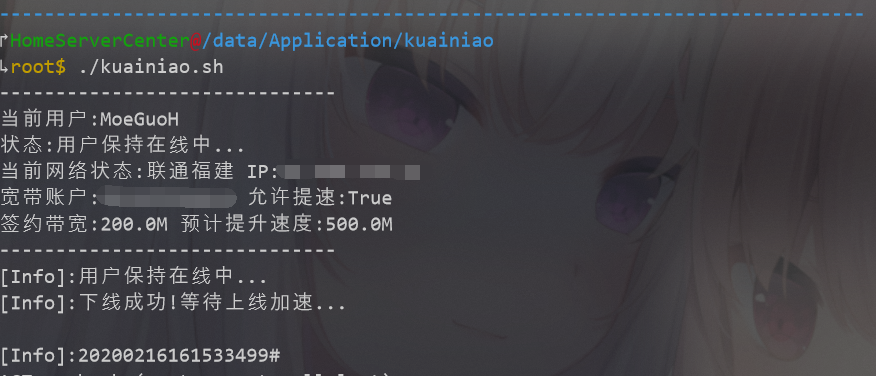

# 保持迅雷快鸟在线提速 -XlNetAcc Keeper
在家中的NAS，软路由，能够保持提速的Python脚本（前提你开了上传会员）

# 使用方法
* 把本项目Clone下来
* 安装必要的Python3库 `pip3 install requests-toolbelt requests`
* 把getCookies.js内的js脚本在浏览器的控制台中执行，获取到一串base64文本，保存到cookies.txt
* chmox +x ./kuainiao.sh & ./kuainiao.sh
* 完成

# 效果

